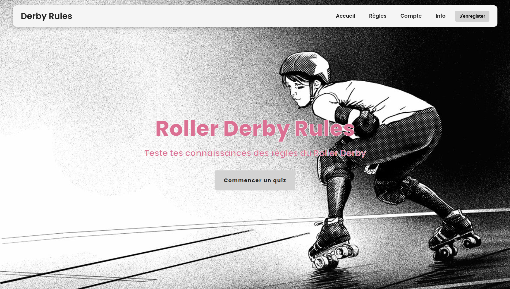

# Group project: quiz application

This is a **group project** I, alongside three other student developers, **built from scratch** during my Continuing Education course at **Toulouse Institute of Technology**.

This quiz application is designed to **help learn the rules of roller derby**, a fast-paced, highly strategical team sport I have been playing competitively for nearly ten years. It was **my idea to build this project**.

Due to **technical difficulties** some team members encountered during our three day long hackathon, this project is **not as functional** as we would have hoped. I was initally tasked with the "Correction" page, which was dependent on a struggling team member's component to be fully functional. When it became apparent that that teammate wouldn't be able to finish up their work in time for the presentation, I **consulted with the team** and **made the decision to take on the homepage**. It ended up being the focus of our end-of-hackathon presentation, **gaining praise for our web design**. I'm glad that I could use my ability to **think quick on my feet** and be **proactive** to reevaluate my priorities and switch my focus to something that would be **valuable to the team**!

## Technologies

- Django, Django REST Framework
- React.js
- PostgreSQL
- Bootstrap

## Skills

### Project management

- **Develop an entire application as a team**
- Manage a project using **Agile methodology**
- Design the product with **wireframes** and **mockups** on **Figma**
- **Design a database** using **UML diagrams**
- **Set up and manage** a project with **git**

### Back-end

- Create a **REST API**
- Use **Django Models to create tables, their fields**, and various constraints
- Set up **query parameters** in Django REST Framework

### Front-end

- Create **reusable React components**
- Create a **fully responsive**, **animation rich homepage** using vanilla CSS
- Use **Bootstrap** on other pages
- Add **icons from Font Awesome** and **Google Fonts**

## My own contributions to the team

- **Django models** based on the project's **UML diagrams**
- **"Correction" page** and its "Explications" component
- Fully responsive, animated, sleak **homepage**

The homepage has its own repository [here](https://github.com/dinahdeichtmann/react_homepage).

## Other vesion

The same project was initially built using different technologies (Node.js + Vue.js). It is fully functional. Find it [here](https://github.com/dinahdeichtmann/node_vue_rollerderbyquiz).
